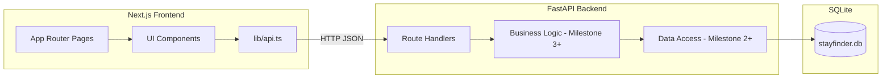

# StayFinder

An original full-stack marketplace for browsing and booking stays — built as an Airbnb-style assignment project using Next.js, FastAPI, and SQLite.

## Tech Stack

| Layer | Technology |
| --- | --- |
| Frontend | Next.js (App Router), TypeScript, Tailwind CSS |
| Backend | Python, FastAPI, Pydantic |
| Database | SQLite (via SQLAlchemy async + aiosqlite) |
| Deployment | Vercel (frontend) + Railway/Render (backend) — planned for Milestone 10 |

## Prerequisites

- **Node.js** 18 or newer
- **Python** 3.11 or newer
- **npm** (bundled with Node.js)

## Project Structure

```
StayFinder/
├── frontend/          # Next.js client
│   ├── app/           # App Router pages
│   ├── components/    # Reusable UI components
│   ├── lib/           # API client utilities
│   └── types/         # Shared TypeScript types
├── backend/           # FastAPI server
│   └── app/
│       ├── api/       # Route handlers
│       ├── core/      # Configuration
│       ├── db/        # Database connection
│       └── schemas/   # Pydantic models
└── README.md
```

## Local Setup

### 1. Clone and enter the repository

```bash
git clone <your-repo-url>
cd StayFinder
```

### 2. Backend

```bash
cd backend
python -m venv .venv

# Windows
.venv\Scripts\activate

# macOS / Linux
source .venv/bin/activate

pip install -r requirements.txt
copy .env.example .env   # Windows
# cp .env.example .env   # macOS / Linux

uvicorn app.main:app --reload --port 8000
```

The API runs at [http://localhost:8000](http://localhost:8000).

Health check: [http://localhost:8000/api/v1/health](http://localhost:8000/api/v1/health)

Interactive docs: [http://localhost:8000/docs](http://localhost:8000/docs)

### 3. Frontend

In a second terminal:

```bash
cd frontend
npm install
copy .env.local.example .env.local   # Windows
# cp .env.local.example .env.local   # macOS / Linux

npm run dev
```

The app runs at [http://localhost:3000](http://localhost:3000). The home page shows an **API connected** badge when the backend is reachable.

## Architecture Overview



### Design principles

- **Thin routes, thick services** — HTTP handlers validate and delegate; business rules live in service modules (added in Milestone 3).
- **Versioned API** — All endpoints are prefixed with `/api/v1`.
- **Typed boundaries** — Pydantic on the backend, TypeScript interfaces on the frontend.
- **Separate deployments** — Frontend and backend communicate over HTTP with CORS configured for cross-origin requests.

## Assumptions

- **Authentication** is simplified/mocked (session-based guest vs host roles).
- **Payments** are mocked — no real payment gateway.
- **Images** use placeholder URLs from seed data (no cloud upload in core scope).
- **Maps** may use a static image or lightweight library.
- **Prices** are stored in cents (integer) to avoid floating-point rounding errors.

## Database Schema

> To be documented in Milestone 2 after tables and seed data are implemented.

Planned entities: `users`, `listings`, `listing_photos`, `amenities`, `listing_amenities`, `bookings`, `reviews`, `wishlists`.

## API Overview

> To be documented in Milestone 3 as endpoints are built.

| Method | Endpoint | Description | Status |
| --- | --- | --- | --- |
| GET | `/api/v1/health` | Service health check | Implemented |

## Milestone Progress

- [x] **M1** — Project setup (monorepo, FastAPI skeleton, Next.js shell, health check)
- [ ] **M2** — Database design and seed data
- [ ] **M3** — Backend listing/search APIs
- [ ] **M4** — Frontend layout and listing cards
- [ ] **M5** — Search and filters
- [ ] **M6** — Listing detail page
- [ ] **M7** — Booking flow
- [ ] **M8** — Host CRUD
- [ ] **M9** — Wishlist
- [ ] **M10** — Polish and deployment

## License

Assignment project — for evaluation purposes.
